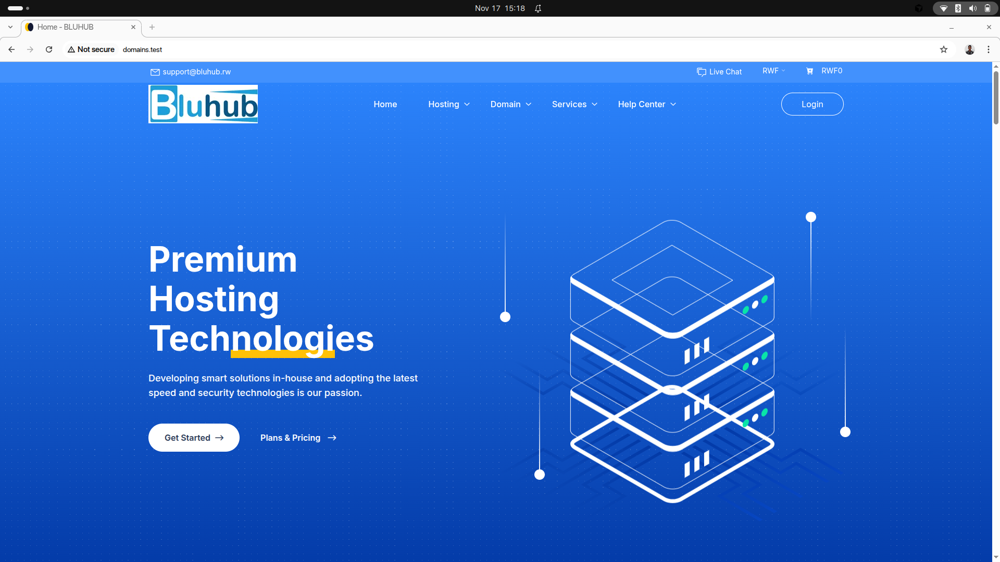

# BLUHUB

A domain registration and web hosting platform built with Laravel 12, Livewire 4, and Stripe.

## Features

- Domain search, registration, and renewal via EPP
- Shared hosting plans with feature comparison
- VPS provisioning via Contabo
- Stripe checkout and PawaPay mobile money payments
- Multi-currency pricing with automatic exchange rate conversion
- Customer dashboard for managing domains, subscriptions, and invoices
- Admin panel for orders, pricing, TLD management, and activity logs

## Stack

- **PHP 8.5** / **Laravel 12**
- **Livewire 4** for reactive UI
- **Stripe** for card payments, **PawaPay** for mobile money
- **africc/php-epp2** for domain registration
- **SQLite** (dev) / MySQL (production)

## Getting Started

```bash
composer install
npm install && npm run build
cp .env.example .env
php artisan key:generate
php artisan migrate --seed
php artisan serve
```

## Testing

```bash
php artisan test --compact
```

## Screenshots




