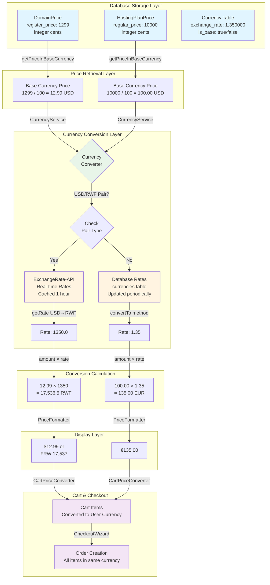
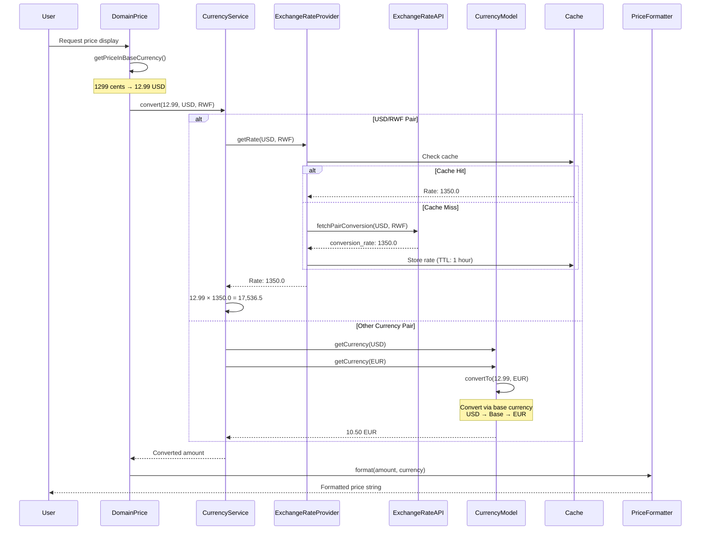
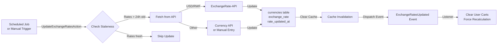

# Price Storage & Currency Exchange Architecture

## Why Tld Are Stored in Cents (Minor Units)

### 1. **Precision & Accuracy**
- **Avoids Floating-Point Errors**: Storing prices as integers eliminates floating-point precision issues that can cause calculation errors (e.g., `0.1 + 0.2 = 0.30000000000000004`)
- **Exact Financial Calculations**: Integer arithmetic ensures exact calculations for financial operations
- **Database Storage**: Integer columns (`integer` type) are more efficient and reliable than decimal/float types

### 2. **Payment Processor Compatibility**
- **Stripe Integration**: Stripe and most payment processors require amounts in minor units (cents for USD)
- **API Consistency**: Payment APIs expect integer amounts, not floats
- **Example**: `$12.99` is stored as `1299` cents, which Stripe expects directly

### 3. **Currency-Specific Storage Rules**
- **USD (International Domains)**: Stored in **cents** (e.g., `1299` = `$12.99`)
- **RWF (Local Domains)**: Stored as **whole units** (zero-decimal currency, e.g., `5000` = `5000 RWF`)
- **Hosting Plans**: Always stored in **USD cents** regardless of display currency

### 4. **Code Evidence**

```php
// Tld.php - Line 83-99
public function getPriceInBaseCurrency(string $priceType = 'register_price'): float
{
    $rawPrice = $this->{$priceType};
    $baseCurrency = $this->getBaseCurrency();
    
    // RWF uses zero-decimal (stored as whole units), USD uses cents
    if ($baseCurrency === 'RWF') {
        return (float) $rawPrice;
    }
    
    // Convert from cents to the main currency unit for USD
    return (float) $rawPrice / 100;
}
```

```php
// HostingPlanPrice.php - Line 99-114
public function getPriceInBaseCurrency(string $priceType = 'regular_price'): float
{
    $rawPrice = $this->{$priceType};
    $baseCurrency = $this->getBaseCurrency();
    
    if ($this->usesZeroDecimalCurrency($baseCurrency)) {
        return (float) $rawPrice;
    }
    
    // Convert from cents to the main currency unit
    return (float) $rawPrice / 100;
}
```

## Currency Exchange Flow

### Architecture Overview

The currency exchange system uses a **dual-strategy approach**:

1. **USD/RWF Pairs**: Real-time API rates from ExchangeRate-API
2. **Other Currencies**: Database-stored exchange rates updated periodically

### Data Flow Diagram



### Detailed Exchange Rate Flow



### Key Components

#### 1. **Price Models** (`DomainPrice`, `HostingPlanPrice`)
- Store prices as **integers** in database
- Convert to float when retrieving: `cents / 100`
- Base currency:
  - **DomainPrice**: USD (international) or RWF (local)
  - **HostingPlanPrice**: Always USD

#### 2. **CurrencyService** / **CurrencyConverter**
- Main conversion service
- Routes USD/RWF pairs to API
- Routes other pairs to database rates
- Implements caching at multiple levels:
  - **Request-level cache**: Avoids duplicate queries in same request
  - **Persistent cache**: Redis/file cache (1 hour TTL)

#### 3. **ExchangeRateProvider**
- Handles USD/RWF conversions via ExchangeRate-API
- Caches rates with metadata (last_update, next_update)
- Falls back to config rates if API fails

#### 4. **Currency Model**
- Stores exchange rates in `currencies` table
- Base currency has `is_base = true`, `exchange_rate = 1.0`
- Other currencies store rate relative to base
- Conversion formula:
  ```
  If converting FROM non-base TO non-base:
    1. Convert to base: amount / from_rate
    2. Convert to target: base_amount × to_rate
  ```

#### 5. **CartPriceConverter**
- Converts cart items to user's preferred currency
- Handles special item types (hosting, subscriptions)
- Preserves original currency for audit trail

#### 6. **PriceFormatter**
- Formats amounts with currency symbols
- Handles zero-decimal currencies (RWF, JPY, etc.)
- Determines decimal places based on currency rules

### Exchange Rate Update Process



### Caching Strategy

1. **Request-Level Cache** (`RequestCache`)
   - Stores rates/currencies for current request
   - Prevents duplicate database queries
   - Lives only for request duration

2. **Persistent Cache** (Redis/File)
   - Exchange rates: 1 hour TTL
   - Currency models: 1 hour TTL
   - Active currencies list: 1 hour TTL
   - Base currency: 1 hour TTL

3. **Cache Keys**
   - Rate: `exchange_rate:USD:RWF`
   - Currency: `currency:USD`
   - Metadata: `exchange_rate_metadata:USD:RWF`

### Example: Complete Flow

**Scenario**: User views domain price in RWF

1. **Database**: `domain_prices.register_price = 1299` (cents)
2. **Model**: `getPriceInBaseCurrency()` → `12.99 USD`
3. **User Currency**: Session has `selected_currency = RWF`
4. **Conversion**: `CurrencyService::convert(12.99, USD, RWF)`
5. **Rate Lookup**: 
   - Check request cache → miss
   - Check persistent cache → hit: `1350.0`
   - Return rate: `1350.0`
6. **Calculation**: `12.99 × 1350.0 = 17,536.5 RWF`
7. **Formatting**: `PriceFormatter::format(17536.5, RWF)` → `"FRW 17,537"`
8. **Display**: User sees `FRW 17,537`

### Special Cases

#### Zero-Decimal Currencies
- **RWF**: Stored as whole units, no division by 100
- **JPY, KRW, VND**: Also zero-decimal
- Formatting shows no decimal places

#### Hosting Plans
- Always stored in USD cents
- Converted to user currency for display
- Monthly prices converted separately for billing cycle calculations

#### Cart Items
- Each item can have different base currency
- Converted to user's preferred currency on-the-fly
- Original currency preserved in attributes for audit

### Benefits of This Architecture

1. **Accuracy**: Integer storage prevents floating-point errors
2. **Performance**: Caching reduces API calls and database queries
3. **Flexibility**: Supports multiple currencies with different storage rules
4. **Reliability**: Fallback mechanisms ensure system continues working if API fails
5. **Audit Trail**: Original prices/currencies preserved in cart/order items
