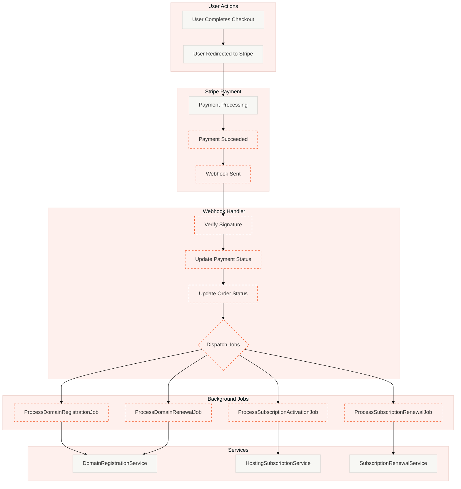
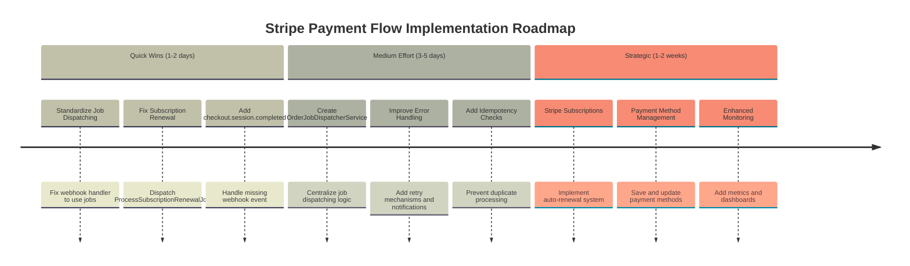
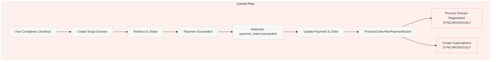

# Roadmap: Stripe Payment Flow with Job Dispatching

This roadmap outlines how Stripe payments should work, including proper job dispatching for domain registration, domain renewal, subscription creation, and subscription renewal.

## Current State Analysis

### Existing Components

**Payment Flow:**
- `PaymentController::stripeCheckout()` - Creates Stripe checkout session
- `CreateStripeCheckoutSessionAction` - Handles checkout session creation
- `StripeWebhookController` - Handles Stripe webhook events
- `ProcessOrderAfterPaymentAction` - Processes orders after payment confirmation

**Jobs:**
- `ProcessDomainRegistrationJob` - Handles new domain registrations
- `ProcessDomainRenewalJob` - Handles domain renewals
- `ProcessSubscriptionActivationJob` - Creates subscriptions from orders
- `ProcessSubscriptionRenewalJob` - Renews existing subscriptions

**Services:**
- `DomainRegistrationService` - Domain registration logic
- `HostingSubscriptionService` - Subscription creation logic
- `OrderProcessingService` - Order processing orchestration

### Current Issues

1. **Inconsistent Job Dispatching**:
   - KPay payments dispatch jobs in `PaymentController::dispatchOrderProcessingJobs()`
   - Stripe payments dispatch via `ProcessOrderAfterPaymentAction` which doesn't use jobs consistently
   - Subscription renewals via webhooks don't dispatch `ProcessSubscriptionRenewalJob`

2. **Missing Job Dispatch for Subscription Renewals**:
   - `StripeWebhookController::handleInvoicePaymentSucceeded()` creates renewal orders but doesn't dispatch renewal jobs
   - Renewals are processed synchronously in the webhook handler

3. **Mixed Synchronous/Asynchronous Processing**:
   - Some operations run synchronously in webhook handlers
   - Should use jobs for all long-running operations

## Proposed Architecture

### Payment Flow Overview



## Implementation Timeline



## Implementation Roadmap

### Phase 1: Quick Wins (1-2 days)

**1.1 Standardize Job Dispatching in Webhook Handler**
- Update `StripeWebhookController::handlePaymentIntentSucceeded()` to dispatch jobs instead of processing synchronously
- Create a unified job dispatching method similar to `PaymentController::dispatchOrderProcessingJobs()`

**1.2 Fix Subscription Renewal Job Dispatch**
- Update `StripeWebhookController::handleInvoicePaymentSucceeded()` to dispatch `ProcessSubscriptionRenewalJob`
- Remove synchronous processing from webhook handler

**1.3 Add Missing Webhook Event: `checkout.session.completed`**
- Handle `checkout.session.completed` event for initial payments
- Ensure proper job dispatching for new registrations and subscriptions

### Phase 2: Medium Effort (3-5 days)

**2.1 Create Unified Job Dispatcher Service**
- Create `OrderJobDispatcherService` to centralize job dispatching logic
- Replace duplicate job dispatching code in `PaymentController` and `StripeWebhookController`
- Ensure consistent job dispatching across all payment methods

**2.2 Improve Error Handling and Retry Logic**
- Add proper retry mechanisms for failed jobs
- Implement job failure notifications
- Add monitoring and alerting for job failures

**2.3 Add Idempotency Checks**
- Ensure jobs can be safely retried
- Add checks to prevent duplicate processing
- Implement proper job deduplication

### Phase 3: Strategic Improvements (1-2 weeks)

**3.1 Implement Stripe Subscriptions for Auto-Renewals**
- Create Stripe subscriptions for hosting plans
- Handle subscription lifecycle events (created, updated, cancelled)
- Automatically renew subscriptions via Stripe's billing system

**3.2 Add Payment Method Management**
- Allow users to save payment methods
- Enable automatic payment retry for failed renewals
- Implement payment method updates

**3.3 Enhanced Monitoring and Observability**
- Add comprehensive logging for all payment flows
- Implement metrics and dashboards for payment success rates
- Add alerts for payment failures and job processing issues

## Detailed Flow Diagrams

### Current Flow: Initial Payment (Domain Registration)



### Proposed Flow: Initial Payment (Domain Registration)

```mermaid
%%{init: {'theme': 'base', 'themeVariables': {
  'primaryColor': '#F7F7F4',
  'primaryBorderColor': '#D4D4D0',
  'primaryTextColor': '#333',
  'secondaryColor': '#EAEBE7',
  'tertiaryColor': '#FEF0ED'
}}}%%
flowchart TB
    subgraph Proposed["Proposed Flow"]
        A2[User Completes Checkout] --> B2[Create Stripe Session]
        B2 --> C2[Redirect to Stripe]
        C2 --> D2[Payment Succeeded]
        D2 --> E2[Webhook: payment_intent.succeeded]
        E2 --> F2[Update Payment & Order]
        F2 --> G2[OrderJobDispatcherService]
        G2 --> H2[Dispatch ProcessDomainRegistrationJob]
        G2 --> I2[Dispatch ProcessSubscriptionActivationJob]
        H2 --> J2[DomainRegistrationService<br/>ASYNC]
        I2 --> K2[HostingSubscriptionService<br/>ASYNC]
    end

    style A2 fill:#FEF0ED,stroke:#F34F1D,stroke-dasharray:5 5
    style B2 fill:#FEF0ED,stroke:#F34F1D,stroke-dasharray:5 5
    style C2 fill:#FEF0ED,stroke:#F34F1D,stroke-dasharray:5 5
    style D2 fill:#FEF0ED,stroke:#F34F1D,stroke-dasharray:5 5
    style E2 fill:#FEF0ED,stroke:#F34F1D,stroke-dasharray:5 5
    style F2 fill:#FEF0ED,stroke:#F34F1D,stroke-dasharray:5 5
    style G2 fill:#FEF0ED,stroke:#F34F1D,stroke-dasharray:5 5
    style H2 fill:#FEF0ED,stroke:#F34F1D,stroke-dasharray:5 5
    style I2 fill:#FEF0ED,stroke:#F34F1D,stroke-dasharray:5 5
    style J2 fill:#FEF0ED,stroke:#F34F1D,stroke-dasharray:5 5
    style K2 fill:#FEF0ED,stroke:#F34F1D,stroke-dasharray:5 5
```



### Current Flow: Subscription Renewal

```mermaid
%%{init: {'theme': 'base', 'themeVariables': {
  'primaryColor': '#F7F7F4',
  'primaryBorderColor': '#D4D4D0',
  'primaryTextColor': '#333',
  'secondaryColor': '#EAEBE7',
  'tertiaryColor': '#FEF0ED'
}}}%%
flowchart TB
    subgraph CurrentRenewal["Current Renewal Flow"]
        A3[Stripe Invoice Payment] --> B3[Webhook: invoice.payment_succeeded]
        B3 --> C3[Create Renewal Order]
        C3 --> D3[ProcessDomainRegistrationsAction<br/>SYNCHRONOUSLY]
        D3 --> E3[Update Subscription<br/>SYNCHRONOUSLY]
        E3 --> F3[NO ProcessSubscriptionRenewalJob]
    end

    style A3 fill:#F7F7F4,stroke:#D4D4D0
    style B3 fill:#F7F7F4,stroke:#D4D4D0
    style C3 fill:#F7F7F4,stroke:#D4D4D0
    style D3 fill:#FEF0ED,stroke:#F34F1D,stroke-dasharray:5 5
    style E3 fill:#FEF0ED,stroke:#F34F1D,stroke-dasharray:5 5
    style F3 fill:#FEF0ED,stroke:#F34F1D,stroke-dasharray:5 5
```



### Proposed Flow: Subscription Renewal

```mermaid
%%{init: {'theme': 'base', 'themeVariables': {
  'primaryColor': '#F7F7F4',
  'primaryBorderColor': '#D4D4D0',
  'primaryTextColor': '#333',
  'secondaryColor': '#EAEBE7',
  'tertiaryColor': '#FEF0ED'
}}}%%
flowchart TB
    subgraph ProposedRenewal["Proposed Renewal Flow"]
        A4[Stripe Invoice Payment] --> B4[Webhook: invoice.payment_succeeded]
        B4 --> C4[Create Renewal Order]
        C4 --> D4[OrderJobDispatcherService]
        D4 --> E4[Dispatch ProcessSubscriptionRenewalJob]
        E4 --> F4[SubscriptionRenewalService<br/>ASYNC]
        F4 --> G4[Update Subscription Expiry]
        F4 --> H4[Send Renewal Notification]
    end

    style A4 fill:#FEF0ED,stroke:#F34F1D,stroke-dasharray:5 5
    style B4 fill:#FEF0ED,stroke:#F34F1D,stroke-dasharray:5 5
    style C4 fill:#FEF0ED,stroke:#F34F1D,stroke-dasharray:5 5
    style D4 fill:#FEF0ED,stroke:#F34F1D,stroke-dasharray:5 5
    style E4 fill:#FEF0ED,stroke:#F34F1D,stroke-dasharray:5 5
    style F4 fill:#FEF0ED,stroke:#F34F1D,stroke-dasharray:5 5
    style G4 fill:#FEF0ED,stroke:#F34F1D,stroke-dasharray:5 5
    style H4 fill:#FEF0ED,stroke:#F34F1D,stroke-dasharray:5 5
```



## Implementation Details

### 1. OrderJobDispatcherService

Create a new service to centralize job dispatching:

```php
<?php

declare(strict_types=1);

namespace App\Services;

use App\Jobs\ProcessDomainRegistrationJob;
use App\Jobs\ProcessDomainRenewalJob;
use App\Jobs\ProcessSubscriptionActivationJob;
use App\Jobs\ProcessSubscriptionRenewalJob;
use App\Models\Order;
use Illuminate\Support\Facades\Log;

final readonly class OrderJobDispatcherService
{
    public function dispatchJobsForOrder(Order $order, array $contactIds = []): void
    {
        // Create order items from JSON first
        // This should be done before dispatching jobs

        // Dispatch domain registration job for new registrations
        if (!in_array($order->type, ['renewal', 'subscription_renewal'], true)) {
            if ($contactIds !== []) {
                dispatch(new ProcessDomainRegistrationJob($order, $contactIds));
                Log::info('Dispatched domain registration job', [
                    'order_id' => $order->id,
                    'order_number' => $order->order_number,
                ]);
            }
        }

        // Dispatch subscription activation job for new subscriptions
        $hasHostingItems = $order->orderItems()
            ->where('domain_type', 'hosting')
            ->exists();

        if ($hasHostingItems && !in_array($order->type, ['renewal', 'subscription_renewal'], true)) {
            dispatch(new ProcessSubscriptionActivationJob($order));
            Log::info('Dispatched subscription activation job', [
                'order_id' => $order->id,
                'order_number' => $order->order_number,
            ]);
        }

        // Dispatch renewal jobs
        if (in_array($order->type, ['renewal', 'subscription_renewal'], true)) {
            $this->dispatchRenewalJobs($order);
        }
    }

    private function dispatchRenewalJobs(Order $order): void
    {
        if ($order->type === 'renewal') {
            dispatch(new ProcessDomainRenewalJob($order));
            Log::info('Dispatched domain renewal job', [
                'order_id' => $order->id,
                'order_number' => $order->order_number,
            ]);
        }

        if ($order->type === 'subscription_renewal') {
            dispatch(new ProcessSubscriptionRenewalJob($order));
            Log::info('Dispatched subscription renewal job', [
                'order_id' => $order->id,
                'order_number' => $order->order_number,
            ]);
        }
    }
}
```

### 2. Updated StripeWebhookController

Update webhook handlers to use the new service:

```php
// In handlePaymentIntentSucceeded()
$orderJobDispatcher = resolve(OrderJobDispatcherService::class);
$orderJobDispatcher->dispatchJobsForOrder($order, $contactIds);

// In handleInvoicePaymentSucceeded()
$orderJobDispatcher = resolve(OrderJobDispatcherService::class);
$orderJobDispatcher->dispatchJobsForOrder($order);
```

### 3. Webhook Events to Handle

**Required Events:**
- `payment_intent.succeeded` - Initial payment success
- `payment_intent.payment_failed` - Payment failure
- `checkout.session.completed` - Checkout completion (backup)
- `invoice.payment_succeeded` - Subscription renewal payment
- `invoice.payment_failed` - Subscription renewal failure
- `customer.subscription.deleted` - Subscription cancellation
- `charge.refunded` - Refund processing

## Testing Strategy

### Unit Tests
- Test `OrderJobDispatcherService` job dispatching logic
- Test webhook signature verification
- Test order status updates

### Integration Tests
- Test complete payment flow from checkout to job completion
- Test subscription renewal flow
- Test error handling and retry logic

### Feature Tests
- Test Stripe checkout session creation
- Test webhook handling for all events
- Test job processing for all order types

## Migration Plan

1. **Week 1**: Implement `OrderJobDispatcherService` and update `StripeWebhookController`
2. **Week 2**: Add comprehensive tests and monitoring
3. **Week 3**: Deploy to staging and perform thorough testing
4. **Week 4**: Deploy to production with monitoring and rollback plan

## Success Metrics

- All payment processing moved to background jobs
- Webhook response time < 200ms
- Job processing success rate > 99%
- Zero duplicate processing incidents
- Proper error notifications for all failures

## Notes

- Ensure all jobs are idempotent
- Add proper logging at each step
- Implement job retry mechanisms
- Add monitoring and alerting
- Consider using Stripe's subscription management for automatic renewals
